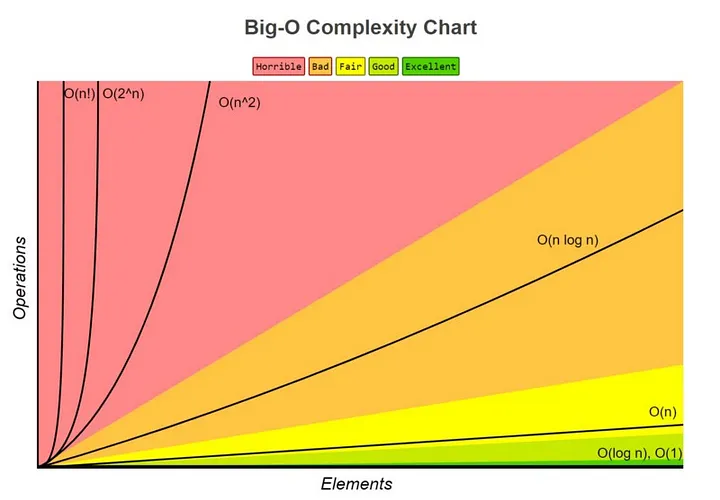

# BIG O

- [BIG O](#big-o)
- [Conceito](#conceito)
- [Tipos de Complexidade](#tipos-de-complexidade)
- [O detalhe do "Pior Caso"](#o-detalhe-do-pior-caso)
- [Complexidade de Espaço](#complexidade-de-espaço)
- [Importância](#importância)
- [Tabela visual](#tabela-visual)
- [Gráfico do Big O](#gráfico-do-big-o)

## Conceito

O Big O é uma notação matemática que não mede tempo em segundos (pois isso depende do hardware), mas sim o crescimento de operações à medida em que a entrada ($n$) aumenta. Ele é usado para descrever a eficiência de um algoritmo, especialmente em termos de tempo de execução e uso de memória.

## Tipos de Complexidade

- **$O(1)$: Complexidade constante.**
  - O tempo de execução é o mesmo, independentemente do tamanho da entrada.
  - **Exemplo:** Acessar um elemento em um array.
  - **Analogia:** Pense como abrir um dicionário e encontrar exatamente a palavra que você quer, sem precisar ler as outras.

- **$O(n)$: Complexidade linear.**
  - O tempo de execução cresce proporcionalmente ao tamanho da entrada.
  - **Exemplo:** Percorrer um array para encontrar um elemento específico.
  - **Analogia:** Pense que em um dicionário, isso ocorre quando eu tenho que ler cada palavra até encontrar a que eu quero; o tempo de busca aumenta à medida que o dicionário fica maior.

- **$O(\log n)$: Complexidade logarítmica.**
  - O tempo de execução cresce proporcionalmente ao logaritmo do tamanho da entrada.
  - **Exemplo:** Busca binária em um array ordenado.
  - **Analogia:** Pense em um dicionário: se a cada vez que eu abro ao meio o dicionário, eu delimito que a palavra está a partir daquela metade, eu corto pela metade a quantidade de elementos que faltam olhar. Isso é muito eficiente para grandes dicionários.

- **$O(n \log n)$: Complexidade linear-logarítmica.**
  - O tempo de execução cresce proporcionalmente ao produto do tamanho da entrada e o logaritmo do tamanho da entrada.
  - **Exemplo:** Algoritmos de ordenação eficientes como Merge Sort e Quick Sort.
  - **Analogia:** Pense em um dicionário onde você tem que organizar as palavras; isso pode ser feito de maneira eficiente usando técnicas que combinam divisão e conquista.

- **$O(n^2)$: Complexidade quadrática.**
  - O tempo de execução cresce proporcionalmente ao quadrado do tamanho da entrada.
  - **Exemplo:** Comparar cada elemento de um array com todos os outros elementos.
  - **Analogia:** Pense em um dicionário onde você tem que comparar cada palavra com todas as outras para encontrar uma correspondência; o tempo de busca aumenta drasticamente à medida que o dicionário cresce.

## O detalhe do "Pior Caso"

Ao falar sobre Big O, geralmente nos referimos ao **"pior caso"**, ou seja, a situação em que o algoritmo leva o máximo de tempo possível.

Por exemplo, no $O(n)$, caso a palavra seja a primeira do dicionário, o tempo de busca seria constante $O(1)$, mas caso seja a última palavra, o tempo de busca é $O(n)$. Por isso, usamos o Big O para definir esse limite máximo de esforço que o algoritmo terá.

## Complexidade de Espaço

Além da complexidade de tempo, o Big O também é usado para descrever a **complexidade de espaço**, que se refere à quantidade de memória extra que um algoritmo usa em relação ao tamanho da entrada.

- **$O(1)$ de espaço:** O algoritmo usa uma quantidade constante de memória (faz tudo "dentro" do próprio array original).
- **$O(n)$ de espaço:** O algoritmo precisa criar uma cópia dos dados ou uma nova estrutura proporcional ao tamanho da entrada.

## Importância

Ter uma boa base em Big O é essencial para entender como os algoritmos se comportam e para escolher a melhor solução para um problema específico. Ele nos ajuda a comparar diferentes algoritmos e a prever como eles se comportarão à medida que o tamanho da entrada aumenta.

Entender o Big O é crucial para desenvolver algoritmos eficientes e escaláveis. Ele nos permite prever o comportamento de uma aplicação no mundo real, onde os dados podem ser muito grandes, garantindo que nossos programas sejam rápidos e ocupem o mínimo de recursos necessário.

## Tabela visual

| Elementos ($n$) | $O(\log n)$   | $O(n)$          | $O(n^2)$            |
| --------------- | ------------- | --------------- | ------------------- |
| **10**          | ~3 operações  | 10 operações    | 100 operações       |
| **100**         | ~7 operações  | 100 operações   | 10.000 operações    |
| **1.000**       | ~10 operações | 1.000 operações | 1.000.000 operações |

## Gráfico do Big O

